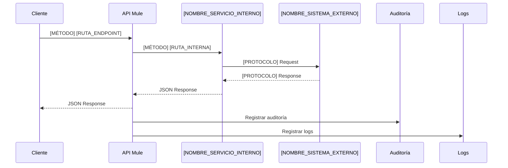

# [NOMBRE_DEL_SERVICIO] – [IDENTIFICADOR_TÉCNICO]

::: tip **Información del Servicio**
**Endpoint:** `[RUTA_COMPLETA_DEL_ENDPOINT]`  
**Método:** [GET/POST/PUT/DELETE]  
**Versión:** [v1/v2/etc]  
**Estándar TM Forum:** [TMFXXX NOMBRE_ESTÁNDAR]  
**Categoría:** [CATEGORÍA_PRINCIPAL] / [SUBCATEGORÍA]  
**Equipo Responsable:** [NOMBRE_DEL_SQUAD]  
**Contacto:** [correo@empresa.com]  
**Fecha de Creación:** [YYYY-MM-DD]  
**Última Actualización:** [YYYY-MM-DD]  
:::

## 0. Control de Versiones

**ChangeLog**

| Fecha            | Version API   | Version Documento  | Descripción                             | Autor                  |
|------------------|---------------|--------------------|-----------------------------------------|------------------------|
| [fecha_version]  | [version_api] | [version_doc]      | [descripción_cambio]                    | [autor_cambio]         |
| [fecha_version]  | [version_api] | [version_doc]      | [descripción_cambio]                    | [autor_cambio]         |


## 1. Resumen del Servicio

[DESCRIPCIÓN_BREVE_DEL_SERVICIO_EN_UNA_O_DOS_FRASES]

[DESCRIPCIÓN_DETALLADA_INCLUYENDO:]
- Propósito principal del servicio
- Endpoint público y su funcionalidad
- Servicios internos que consume (si aplica)
- Categoría de negocio (Fulfillment/Service Management/etc)
- Alineación con mejores prácticas
- Arquitectura y desacoplamiento

## 2. Descripción Funcional

[DESCRIPCIÓN_TÉCNICA_DETALLADA_INCLUYENDO:]
- Funcionalidad específica del servicio
- Parámetros de entrada y salida
- Servicios internos que consume
- Sistemas externos involucrados
- Casos de integración
- Diseño de la arquitectura

## 3. Casos de Uso

- [CASO_DE_USO_1: Descripción específica del caso de uso]
- [CASO_DE_USO_2: Descripción específica del caso de uso]
- [CASO_DE_USO_3: Descripción específica del caso de uso]

## 4. Especificación de Contrato

### 4.1 Endpoints y Métodos

- **[MÉTODO]** `[RUTA_DEL_ENDPOINT]`
  - **Descripción:** [DESCRIPCIÓN_ESPECÍFICA_DE_LO_QUE_HACE_EL_ENDPOINT]
  - **Parámetros de consulta:**
    - `[nombre_parametro]` ([tipo], [opcional/requerido]): [descripción]. Ejemplo: `[valor_ejemplo]`
    - `[nombre_parametro2]` ([tipo], [opcional/requerido]): [descripción]. Ejemplo: `[valor_ejemplo]`
  - **Headers requeridos:**
    - `[nombre_header]` ([tipo], [opcional/requerido]): [descripción]
    - `[nombre_header2]` ([tipo], [opcional/requerido]): [descripción]

### 4.2 Esquemas de Datos (JSON Schema)

**Parámetros de entrada (query/body):**

| Nombre            | Tipo   | Requerido | Descripción                                 | Ejemplo                |
|-------------------|--------|-----------|---------------------------------------------|------------------------|
| [nombre_parametro]| [tipo] | [Sí/No]   | [descripción_detallada]                     | [valor_ejemplo]        |
| [nombre_parametro2]|[tipo] | [Sí/No]   | [descripción_detallada]                     | [valor_ejemplo]        |

**Headers requeridos:**

| Nombre         | Requerido | Tipo   | Descripción                                 |
|---------------|-----------|--------|---------------------------------------------|
| [nombre_header]| [Sí/No]   | [Tipo] | [descripción_detallada]                     |
| [nombre_header2]|[Sí/No]   | [Tipo] | [descripción_detallada]                     |

**Campos de salida (response):**

| Campo                        | Tipo    | Descripción                                 |
|------------------------------|---------|---------------------------------------------|
| [campo_principal]            | object  | [descripción_del_objeto_principal]         |
| └─ [subcampo]               | [tipo]  | [descripción_del_subcampo]                 |
|    ├─ [propiedad]           | [tipo]  | [descripción_de_la_propiedad]              |
|    ├─ [propiedad2]          | [tipo]  | [descripción_de_la_propiedad]              |
|    └─ [propiedad3]          | [tipo]  | [descripción_de_la_propiedad]              |

**Respuesta 200 (application/json):**
```json
{
  "[objeto_principal]": {
    "[subobjeto]": {
      "[propiedad]": "[valor_ejemplo]",
      "[propiedad2]": "[valor_ejemplo]"
    },
    "[subobjeto2]": {
      "[propiedad]": "[valor_ejemplo]"
    }
  }
}
```

### 4.3 Ejemplos de Request / Response

**Ejemplo de Request:**
```
[MÉTODO] [RUTA_COMPLETA]?[parametro1]=[valor1]&[parametro2]=[valor2]
```

**Ejemplo de Response exitoso (200):**
```json
{
  "[objeto_principal]": {
    "[subobjeto]": {
      "[propiedad]": "[valor_ejemplo]",
      "[propiedad2]": "[valor_ejemplo]"
    }
  }
}
```

**Ejemplo de Error enriquecido (400):**
```json
{
  "code": 400,
  "reason": "[CÓDIGO_DE_ERROR_ESPECÍFICO]",
  "message": "[MENSAJE_DESCRIPTIVO_DEL_ERROR]",
  "status": "Bad Request",
  "referenceError": "[CÓDIGO_REFERENCIA_ÚNICO]",
  "@type": "[TIPO_DE_ERROR]",
  "@schemaLocation": "[URL_DEL_SCHEMA_DE_ERROR]",
  "@baseType": "Error"
}
```

**Ejemplo de Error enriquecido (401):**
```json
{
  "code": 401,
  "reason": "[CÓDIGO_DE_ERROR_ESPECÍFICO]",
  "message": "[MENSAJE_DESCRIPTIVO_DEL_ERROR]",
  "status": "Unauthorized",
  "referenceError": "[CÓDIGO_REFERENCIA_ÚNICO]",
  "@type": "[TIPO_DE_ERROR]",
  "@schemaLocation": "[URL_DEL_SCHEMA_DE_ERROR]",
  "@baseType": "Error"
}
```

**Ejemplo de Error enriquecido (500):**
```json
{
  "code": 500,
  "reason": "[CÓDIGO_DE_ERROR_ESPECÍFICO]",
  "message": "[MENSAJE_DESCRIPTIVO_DEL_ERROR]",
  "status": "Internal Server Error",
  "referenceError": "[CÓDIGO_REFERENCIA_ÚNICO]",
  "@type": "[TIPO_DE_ERROR]",
  "@schemaLocation": "[URL_DEL_SCHEMA_DE_ERROR]",
  "@baseType": "Error"
}
```

### 4.4 Códigos de Error

| Código | Descripción |
|--------|-------------|
| 200    | Respuesta exitosa. |
| 400    | Petición inválida o parámetros incorrectos. |
| 401    | Credenciales de cliente inválidas o no autorizadas. |
| 500    | Error interno del servidor o error en el sistema externo. |

**Notas:**
- [EXPLICACIÓN_ESPECÍFICA_DE_CÓMO_SE_GENERAN_LOS_ERRORES]
- [CONDICIONES_ESPECÍFICAS_PARA_CADA_TIPO_DE_ERROR]

## 5. Métricas y SLA

**Métricas sugeridas para el monitoreo del servicio:**

| Métrica                        | Descripción                                              | Frecuencia/Recomendación |
|-------------------------------|----------------------------------------------------------|--------------------------|
| Tiempo de respuesta promedio  | Tiempo medio de respuesta del endpoint                   | < [X] segundo           |
| Disponibilidad                | Porcentaje de tiempo en que el servicio está operativo   | > [X]%                  |
| Tasa de error                 | Porcentaje de respuestas con error (4xx, 5xx)            | < [X]%                  |
| Número de peticiones          | Total de solicitudes recibidas en un periodo             | [FRECUENCIA]            |
| [MÉTRICA_ESPECÍFICA]         | [DESCRIPCIÓN_DE_LA_MÉTRICA]                             | [VALOR_OBJETIVO]        |
| Auditoría de accesos          | Registro de accesos y trazabilidad de peticiones         | 100% de las transacciones|

**SLA típicos recomendados:**

- **Disponibilidad:** [X]% mensual
- **Tiempo de respuesta:** [X] segundo para el [X]% de las peticiones
- **Tasa máxima de error:** [X]% de las transacciones
- **Soporte:** [HORARIO_DE_SOPORTE]

> *Nota: Estos valores son sugeridos. Si existen SLAs formales, deben ser documentados aquí.*

## 6. Dependencias y Compatibilidad

- **Sistema Externo Consumido:**
  - Servicio: [NOMBRE_DEL_SERVICIO_EXTERNO]
  - Host: [IP_HOST_QA], [IP_HOST_PROD]
  - Puerto: [PUERTO]
  - Path: [RUTA_DEL_SERVICIO]
  - Protocolo: [HTTP/SOAP/etc]
  - **Nota:** [DESCRIPCIÓN_DE_LA_INTEGRACIÓN_INTERNA]

- **Librerías y módulos Mule:**
  - [NOMBRE_LIBRERÍA_1]
  - [NOMBRE_LIBRERÍA_2]
  - [NOMBRE_LIBRERÍA_3]

- **Auditoría:**
  - Servicio: [NOMBRE_SERVICIO_AUDITORÍA]
  - Host: [HOST_AUDITORÍA]
  - Path: [RUTA_AUDITORÍA]

- **Dependencias adicionales:**
  - [SERVICIO_DEPENDENCIA_1]
  - [SERVICIO_DEPENDENCIA_2]

## 7. Diagramas

### 7.1 Arquitectura Contexto ETB

### 7.2 Arquitectura Global (Versión Presentación)

```mermaid
flowchart TD
    Cliente["Cliente / Frontend / Portal"]
    API["API Mule\n[RUTA_ENDPOINT]"]
    [SERVICIO_INTERNO]["[NOMBRE_SERVICIO_INTERNO]\n[RUTA_INTERNA]"]
    [SISTEMA_EXTERNO]["[NOMBRE_SISTEMA_EXTERNO]\n([PROTOCOLO])"]
    Auditoria["Auditoría\n[SERVICIO_AUDITORÍA]"]
    Logs["Logs\n[CONFIGURACIÓN_LOGS]"]

    Cliente -->|[MÉTODO] [RUTA_ENDPOINT]| API
    API -->|[MÉTODO] [RUTA_INTERNA]| [SERVICIO_INTERNO]
    [SERVICIO_INTERNO] -->|[PROTOCOLO] Request| [SISTEMA_EXTERNO]
    [SISTEMA_EXTERNO] -->|[PROTOCOLO] Response| [SERVICIO_INTERNO]
    [SERVICIO_INTERNO] -->|JSON Response| API
    API -->|JSON Response| Cliente
    API --> Auditoria
    API --> Logs
```

> **Resumen:** [DESCRIPCIÓN_BREVE_DEL_FLUJO_COMPLETO]

### 7.3 Flujo de Datos (Diagrama de Secuencia para Presentación)



> **Resumen:** [DESCRIPCIÓN_BREVE_DEL_FLUJO_PASO_A_PASO]

### 7.4 Diagrama de Clases

// (Completar si aplica para el servicio específico)

## 8. Plan de Retiro (Sunset)

- [DESCRIPCIÓN_DEL_PLAN_DE_RETIRO_SI_EXISTE]
- [POLÍTICAS_DE_NOTIFICACIÓN_Y_VERSIONAMIENTO]
- [TIEMPO_DE_ANTICIPACIÓN_PARA_CAMBIOS_MAYORES]

## 9. Políticas y Dependencias

- **Autenticación:**
  - Headers requeridos: `[HEADER1]`, `[HEADER2]` ([obligatorios/opcionales])
  - [TIPO_DE_SEGURIDAD] ([descripción])
- **Headers adicionales:**
  - `[HEADER_ADICIONAL]` ([obligatorio/opcional], [propósito])
  - `[HEADER_ADICIONAL2]` ([obligatorio/opcional], [propósito])
- **Política de Autodiscovery:**
  - [CONFIGURACIÓN_DE_AUTODISCOVERY]

## 10. Logs y Auditoría

- **Logging:**
  - Configuración: [CONFIGURACIÓN_LOGS]
  - Logs almacenados en archivo: `[NOMBRE_ARCHIVO_LOG]` ([CONFIGURACIÓN_ROTACIÓN])
  - Nivel raíz: [NIVEL_LOG]
  - Loggers específicos para: [TIPOS_DE_LOGGERS]
- **Auditoría:**
  - Integración con servicio: `[SERVICIO_AUDITORÍA]` para registro de logs de auditoría
  - Header `[HEADER_AUDITORÍA]` requerido para trazabilidad

## 11. Calidad, Monitoreo y Pruebas

- **Cobertura de pruebas:**
  - Uso de [HERRAMIENTA_PRUEBAS] para pruebas automáticas
  - Última fecha de pruebas de performance: [YYYY-MM-DD]
  - Cobertura de pruebas: [X]%
- **Monitoreo:**
  - Gestión y monitoreo centralizado a través de [PLATAFORMA_MONITOREO]
  - Disponibilidad monitoreada vía [DASHBOARD/MONITOREO]
- **Certificaciones:**
  - Última revisión de seguridad: [YYYY-MM-DD] ([TIPO_PRUEBA])
- **Consideraciones de seguridad:**
  - [CONSIDERACIONES_ESPECÍFICAS_DE_SEGURIDAD]

## 12. Restricciones de Diseño

- [RESTRICCIÓN_1: Descripción específica de la limitación]
- [RESTRICCIÓN_2: Descripción específica de la limitación]
- [RESTRICCIÓN_3: Descripción específica de la limitación]
- **Límites técnicos:**
  - [LÍMITE_TÉCNICO_1]
  - [LÍMITE_TÉCNICO_2]
  - [LÍMITE_TÉCNICO_3]
  - Referencias: [URL_REFERENCIA_1], [URL_REFERENCIA_2]

## 13. Referencias

- RAML: [RUTA_AL_ARCHIVO_RAML]
- Ejemplo de respuesta: [RUTA_AL_EJEMPLO_RESPUESTA]
- Código Mule: [RUTA_AL_CÓDIGO_MULE]
- Configuración QA: [RUTA_A_CONFIGURACIÓN_QA]
- Documentación TM Forum: [URL_DOCUMENTACIÓN_TMFORUM]
- MuleSoft Anypoint Platform: [URL_DOCUMENTACIÓN_MULESOFT]
- [OTRAS_REFERENCIAS_RELEVANTES]

---

## INSTRUCCIONES PARA EL DESARROLLADOR

### ELEMENTOS ESPECÍFICOS DE VITEPRESS

**Metadata del encabezado (líneas 1-5):**
- `title`: Nombre completo del servicio que aparecerá en la navegación y título de la página
- `lang`: Código de idioma y país (es-CO para español Colombia)
- `description`: Descripción completa que aparece en los metadatos de la página y búsquedas

**Tipos de bloques especiales:**
- `::: tip **Información del Servicio**` - Bloque destacado con información clave del servicio
- `> **Resumen:**` - Citas para resúmenes de diagramas
- `> *Nota:*` - Notas importantes en formato de cita

### ELEMENTOS CRÍTICOS A DILIGENCIAR

**1. Mensajes de Error (Sección 4.4):**
- **OBLIGATORIO:** Incluir ejemplos JSON completos para cada código de error (400, 401, 500)
- **OBLIGATORIO:** Cada error debe tener `code`, `reason`, `message`, `status`, `referenceError`, `@type`, `@schemaLocation`, `@baseType`
- **OBLIGATORIO:** Los `referenceError` deben ser únicos y seguir un patrón (ej: ERR-[SERVICIO]-[TIPO]-[NÚMERO])

**2. Diagramas (Sección 7):**
- **OBLIGATORIO:** Diagrama de arquitectura global usando Mermaid
- **OBLIGATORIO:** Diagrama de secuencia usando Mermaid
- **OBLIGATORIO:** Cada diagrama debe tener un resumen explicativo
- **FORMATO:** Usar la sintaxis ```mermaid para los diagramas

**3. Métricas y SLA (Sección 5):**
- **OBLIGATORIO:** Incluir métricas específicas con valores objetivos
- **OBLIGATORIO:** Definir SLA formales si existen, o marcar como "sugeridos"
- **OBLIGATORIO:** Especificar frecuencias de monitoreo

**4. Dependencias (Sección 6):**
- **OBLIGATORIO:** Listar TODOS los sistemas externos consumidos
- **OBLIGATORIO:** Incluir hosts de QA y PROD
- **OBLIGATORIO:** Especificar protocolos y rutas exactas

**5. Logs y Auditoría (Sección 10):**
- **OBLIGATORIO:** Configuración específica de logging
- **OBLIGATORIO:** Servicio de auditoría utilizado
- **OBLIGATORIO:** Headers requeridos para trazabilidad

### ELEMENTOS OPCIONALES PERO RECOMENDADOS

- **Sección 8 (Plan de Retiro):** Completar si existe política formal
- **Sección 11 (Calidad):** Incluir métricas de cobertura de pruebas
- **Sección 12 (Restricciones):** Documentar límites técnicos específicos
- **Sección 13 (Referencias):** Incluir URLs a documentación externa relevante

### FORMATO DE CÓDIGO

- **JSON:** Usar bloques ```json para ejemplos de request/response
- **HTTP:** Usar bloques ``` para ejemplos de requests HTTP
- **Mermaid:** Usar bloques ```mermaid para diagramas
- **Tablas:** Usar formato Markdown estándar para tablas de datos

### VALIDACIONES FINALES

Antes de entregar la documentación, verificar:
1. ✅ Todos los ejemplos de error están completos
2. ✅ Los diagramas se renderizan correctamente
3. ✅ Las URLs y rutas son exactas
4. ✅ Los valores de métricas y SLA son realistas
5. ✅ Las dependencias están completamente documentadas
6. ✅ La configuración de logs es específica
7. ✅ Los headers requeridos están claramente identificados 